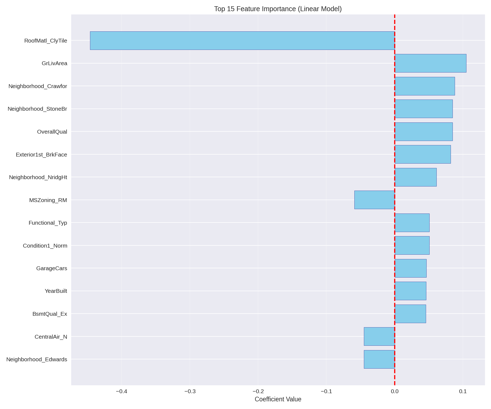

# 🏠 House Price Prediction

Predicting house prices in Ames, Iowa using Machine Learning.

📂 **Dataset:** [Ames Housing Data on Kaggle](https://www.kaggle.com/c/house-prices-advanced-regression-techniques/data)

## 🎯 Results

| Model | CV R² Mean | CV R² Std | Validation RMSE |
|-------|-----------|-----------|-----------------|
| **Lasso (α=0.001)** | **0.8671** | 0.0592 | $25,122 |
| **Ridge (α=50)** | **0.8657** | 0.0532 | $25,107 |
| Linear Regression | 0.8161 | 0.0502 | $22,902 |

**Best Model:** Lasso Regression with automatic feature selection (85 out of 301 features selected)

**Important Note:** 
- Single train/val split showed R² = 0.93 (optimistically biased)
- 5-Fold Cross-Validation revealed true performance: R² = 0.82-0.87
- **Lesson:** Always use cross-validation for reliable model evaluation!

**Interpretation:** The model explains ~87% of price variance. Average prediction error is ~$25k.

## 🛠 Tech Stack

- **Language:** Python
- **Data:** Pandas, NumPy
- **ML:** Scikit-Learn (Linear Regression, Ridge, Lasso, Pipelines, Cross-Validation)
- **Viz:** Matplotlib, Seaborn
- **Env:** Jupyter Notebook

## 📁 Project Structure

```text
house-price-project/
├── data/                    # Raw data (not included in Git)
├── notebooks/               # Jupyter notebooks for EDA & training
├── models/                  # Saved .pkl models (gitignored)
├── results/                 # Generated plots & metrics
├── .gitignore               # Git ignore rules
├── requirements.txt         # Dependencies
└── README.md                # This file
```

## 🚀 Quick Start

```bash
# 1. Clone repo
git clone https://github.com/YOUR_USERNAME/house-price-prediction.git  
cd house-price-prediction

# 2. Create virtual environment
python -m venv venv
source venv/bin/activate  # On Windows: venv\Scripts\activate

# 3. Install dependencies
pip install -r requirements.txt

# 4. Add data
# Download train.csv from Kaggle and place in data/

# 5. Run analysis
jupyter notebook notebooks/01_exploratory_analysis.ipynb
```

## 💻 Usage Example

```python
import joblib
import pandas as pd
import numpy as np

# Load artifacts
model = joblib.load('models/lasso_model.pkl')
preprocessor = joblib.load('models/preprocessor.pkl')

# Prepare new data (example features)
new_house = pd.DataFrame({
    'OverallQual': [8],
    'GrLivArea': [2000],
    'GarageCars': [2],
    'TotalBsmtSF': [1000],
    '1stFlrSF': [1200],
    # ... other features (all 79 features needed)
})

# Preprocess and predict

processed = preprocessor.transform(new_house)
price_log = model.predict(processed)
price = np.expm1(price_log)  # Convert back from log scale

print(f"Estimated price: ${price[0]:,.0f}")
```

## 📊 Key Findings

- Top 3 Features: OverallQual, GrLivArea, GarageCars drive price the most.
- Data Quality: Log-transformation of target reduced skew from 1.88 → 0.12, improving model stability.
- Model Choice: Lasso/Ridge outperformed Linear Regression by ~5% R² gain, demonstrating that regularization is beneficial for this dataset.
- Feature Selection: Lasso automatically selected 85 out of 301 features (28%), improving interpretability.
- Cross-Validation Impact: Single split gave misleading R²=0.93; 5-Fold CV revealed true performance of R²=0.82-0.87.

## 🎓 Key Learnings

- ✅ Cross-validation is essential — single train/test splits can be optimistically biased
- ✅ Regularization matters — Ridge/Lasso improved performance by 5% over plain Linear Regression
- ✅ Log-transformation is critical for skewed target variables in regression
- ✅ Pipelines prevent data leakage during preprocessing and cross-validation
- ✅ Feature importance analysis helps interpret model decisions
- ✅ High variance across CV folds (std: 0.05) indicates data heterogeneity — consider stratified splitting or more data

## 📈 Visualizations

### Predictions vs Actual


*Figure: Each point represents a house. Points close to the red diagonal line indicate accurate predictions.*

### Feature Importance


*Figure: Top 15 features by coefficient magnitude in the Linear Regression model.*

## 📝 Methodology

### 1. Exploratory Data Analysis (EDA)
- Analyzed distributions, correlations, and missing values
- Identified right-skewed target variable (skewness: 1.88)

### 2. Preprocessing
- Log-transformed SalePrice to normalize distribution
- Median imputation for numeric features
- One-Hot Encoding for 43 categorical features
- StandardScaler for numeric features
- **Total:** 301 features after encoding

### 3. Model Training & Evaluation
- Single 80/20 train/validation split (initial)
- **5-Fold Cross-Validation** (final, statistically valid)
- Tested: Linear Regression, Ridge (multiple α), Lasso (multiple α)
- Selected best model based on CV R² score

### 4. Model Selection
- **Lasso (α=0.001) selected**: CV R² = 0.8671, 85 features selected
- Outperformed Linear Regression by ~5% R²

## 👤 Author

Beksultan — rsuvbe


