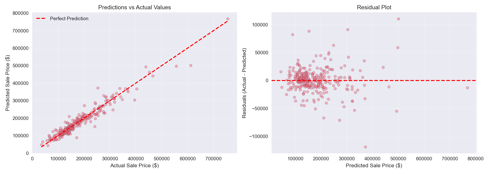
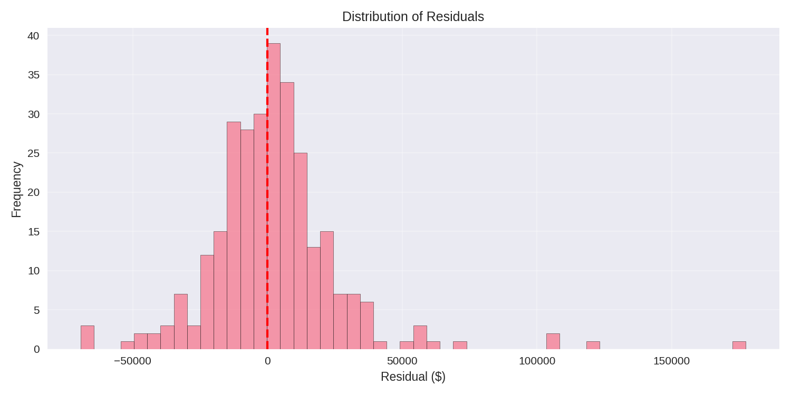

# 🏠 House Price Prediction

Predicting house prices in Ames, Iowa using Machine Learning and a robust Scikit-Learn Pipeline architecture.

📂 **Dataset:** [Ames Housing Data on Kaggle](https://www.kaggle.com/c/house-prices-advanced-regression-techniques/data)

## 🎯 Results

| Model | Best Hyperparameters | Test RMSE | Test MAE | Test R² |
|-------|----------------------|-----------|----------|---------|
| **Linear Regression** | Default (None) | **$22,902** | **$15,076** | **0.9316** |
| **Ridge Regression** | $\alpha = 10$ | $25,107 | — | 0.9178 |
| **Lasso Regression** | $\alpha = 0.001$ | $25,122 | — | 0.9177 |

**Best Model:** Linear Regression (integrated with automated preprocessing via Scikit-Learn `Pipeline` and tuned via `GridSearchCV`).

**Interpretation:** The model explains ~93% of the price variance on unseen test data. The average prediction error is approximately $22,902.

## 🛠 Tech Stack

- **Language:** Python
- **Data Manipulation:** Pandas, NumPy
- **Machine Learning:** Scikit-Learn (`Pipeline`, `ColumnTransformer`, `GridSearchCV`, LinearRegression, Ridge, Lasso)
- **Visualization:** Matplotlib, Seaborn
- **Environment:** Jupyter Lab, Ubuntu Linux

## 📁 Project Structure

```text
house-price-prediction/
├── data/                    # Raw data (train.csv)
├── notebooks/               # Jupyter notebooks for EDA & training
├── models/                  # Saved .pkl model pipelines (gitignored)
├── results/                 # Generated plots & metrics (JSON, PNG)
├── .gitignore               # Git ignore rules
├── requirements.txt         # Dependencies
└── README.md                # This file
```

## 🚀 Quick Start

# 1. Clone repository
git clone [https://github.com/rsuvbe/house-price-prediction.git](https://github.com/rsuvbe/house-price-prediction.git)  
cd house-price-prediction

# 2. Create virtual environment & activate
python -m venv .venv
source .venv/bin/activate  # On Windows: .venv\Scripts\activate

# 3. Install dependencies
pip install -r requirements.txt

# 4. Add data
# Download train.csv from Kaggle and place it in the data/ folder

# 5. Run notebooks
jupyter lab

## 💻 Usage Example
 
  Because the model is saved as a complete Scikit-Learn Pipeline (combining preprocessing and the regressor), raw data can be passed directly into .predict() without manual transformations.

```python
import joblib
import pandas as pd
import numpy as np

# Load the saved end-to-end pipeline
pipeline = joblib.load('../models/linearregression_pipeline.pkl')

# Provide raw features for a new house
new_house = pd.DataFrame({
    'OverallQual': [8],
    'GrLivArea': [2000],
    'GarageCars': [2],
    'TotalBsmtSF': [1000],
    '1stFlrSF': [1200],
    # ... include required features matching the training columns
})

# The pipeline automatically handles imputation, scaling, and one-hot encoding
price_log = pipeline.predict(new_house)
price = np.expm1(price_log)  # Convert back from log scale

print(f"Estimated price: ${price[0]:,.0f}")
```

## 📊 Key Findings

    Top Price Drivers: GrLivArea (above-ground living area), OverallQual (overall material and finish quality), and prime locations like Neighborhood_StoneBr and Neighborhood_Crawfor have the highest positive impact on sale prices.

    Target Transformation: Applying a log-transformation (np.log1p) to SalePrice successfully normalized its right-skewed distribution, significantly stabilizing model training.

    Pipeline Architecture: Encapsulating ColumnTransformer and the regression model into a single Pipeline entirely eliminates data leakage during cross-validation and hyperparameter tuning.

    Regularization: Unregularized Linear Regression slightly outperformed Ridge and Lasso on this specific test split, indicating minimal severe multicollinearity after feature preprocessing.

## 🎓 Key Learnings

    ✅ Pipelines Prevent Leakage: Bundling preprocessing steps ensures transformations are learned strictly from training folds.

    ✅ Log-Transformations Matter: Essential for regression tasks with heavily skewed financial targets.

    ✅ GridSearchCV Integration: Automates hyperparameter search cleanly across complex pipelines.

    ✅ Artifact Portability: Saving the unified pipeline (.pkl) simplifies inference on new production data.


### Predictions vs Actual


*Figure: Scatter plot of predicted vs. actual sale prices aligned against the perfect prediction reference line.*

### Residual Distribution


*Figure: Distribution of residuals centered around zero, confirming unbiased error patterns.*


## 📝 Methodology

1. **Exploratory Data Analysis (EDA):** Inspected data distributions, missing value patterns, and correlations with the target variable.
2. **Data Preprocessing & Engineering:**
   - Log-transformed the target variable (`SalePrice`) to handle right-skewness.
   - Imputed missing values and applied `StandardScaler` to numerical features.
   - Applied `OneHotEncoder` with `handle_unknown='ignore'` to categorical features, resulting in **301 total features**.
3. **Model Training & Tuning:**
   - Evaluated Linear Regression, Ridge, and Lasso models within a `GridSearchCV` framework using 5-fold cross-validation.
4. **Evaluation & Export:**
   - Assessed model generalization via RMSE, MAE, and $R^2$ metrics converted back to original dollar units (`np.expm1`).
   - Exported the optimal pipeline and metrics JSON to disk.


👤 Author

Beksultan (rsuvbe)